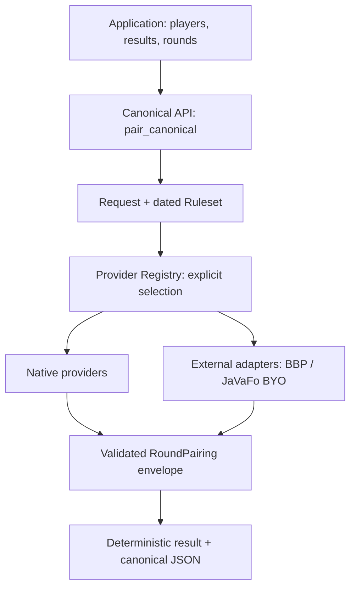

# pairing-core

Deterministic chess pairing library: one round at a time, who-plays-whom —
with boards, colours, bye/float metadata, validation, and reproducibility
envelopes, under explicitly named, dated rulesets.

[](https://github.com/20kevit/pairing-core/actions)
[](pyproject.toml)
[](LICENSE)

> **Status:** version `0.4.1` is a release candidate — committed on `main`,
> CI-green on Python 3.10/3.11/3.12, not yet tagged or published to PyPI.
> See [`docs/RELEASING.md`](docs/RELEASING.md).

## Why pairing-core?

Running a chess tournament requires deciding, every round, who plays whom
under intricate Swiss-system rules — while guaranteeing the result is
**correct, explainable, and exactly reproducible**. pairing-core is that
decision engine as an independent library: your application owns players,
results, and rounds; pairing-core owns the pairing decision and proves
what it did.

- **Library-first.** No server, no database, no UI. Pure Python, zero
  runtime dependencies, importable anywhere.
- **Deterministic by design.** Same request → byte-identical result,
  independent of hash seed, locale, or machine.
- **Explicit rulesets.** Every call names a dated ruleset
  (e.g. `dutch-2026`); unknown rulesets are rejected, never guessed.
- **Provider-oriented.** Native kernels and external engines (BBP, JaVaFo)
  are selected explicitly through a registry — no silent fallback.
- **Honest about FIDE.** Evidence-backed implementations with disclosed
  limitations and registered interpretations. No FIDE endorsement claimed,
  no blanket conformance claimed — ever.

## What it is / what it is not

**It is:** pairing algorithms, pairing constraints, ruleset logic, pairing
validation, deterministic pairing output, provider abstraction, execution
controls (budgets/cancellation), deterministic serialization, and
bring-your-own-binary external-engine adapters.

**It is not:** tournament management. Tournament lifecycle, player
accounts, results/standings persistence, ratings, tie-break calculation,
payments, notifications, UI, or web APIs belong to the consuming
application (e.g. `chess-manager`). See
[`docs/spec/TOURNAMENT_BOUNDARIES.md`](docs/spec/TOURNAMENT_BOUNDARIES.md).

## Key features

- Nine Swiss rulesets plus Berger round robin (see table below).
- Canonical consumer API (`pair_canonical`) plus a frozen legacy API
  (v0.1.0 behavior permanently pinned by golden tests).
- Typed errors for every failure mode (`PairingError` hierarchy).
- Step budgets, wall-clock limits, and cooperative cancellation —
  pathological brackets fail with typed errors, never hangs or partials.
- Reproducibility envelopes: input digests, engine/ruleset versions,
  canonical JSON, digest-verified round-trips.
- TRF interchange subset (BBP-verified) and supervised BBP/JaVaFo
  adapters with bounded output capture and roster validation.
- ~500-test suite: goldens, conformance corpus, hostile audit cases,
  property tests, hash-seed determinism sweeps, adversarial security
  tests, performance gates, release gates.

## Supported pairing systems (v0.4.1)

| Ruleset id | System | Entry point | Standing |
|---|---|---|---|
| `dutch-till2026-compat` | Dutch, pre-2026 formulation (frozen kernel) | `pair` / `pair_canonical` | Behavior pinned by 41 goldens; two frozen deviations (E.5, float-bar) |
| `dutch-2026` | Dutch 2026 (C1–C21 criteria search) | `pairing_core.fide2026.pair_2026` | Implemented, evidence-backed; limitation L1 |
| `dubov-2026` | Dubov 2026 | `pair_2026` | Implemented, evidence-backed |
| `burstein-2026` | Burstein 2026 | `pair_2026` | Implemented, evidence-backed; limitation L1 |
| `lim-2026` | Lim 2026 | `pair_2026` | Implemented, evidence-backed; limitations L4, I-L-412 |
| `double-2026` | Double Swiss 2026 (match play) | `pair_2026` | Implemented, evidence-backed; limitation L3 |
| `team-2026` | Team Swiss 2026 | `pair_2026` | Implemented, evidence-backed; limitation L3 |
| `olympiad-2022` | Olympiad Pairing Rules | `pair_2026` | Implemented, evidence-backed; limitation L5 |
| `baku` helpers | Accelerated Baku method (group split + virtual points) | `pairing_core.fide2026.baku` | Implemented, evidence-backed |
| Berger round robin | FIDE C.05 Annex 1 tables, single/double | `round_robin` | Validated |

"Implemented, evidence-backed" means: built from retrieved source text,
covered by rule→source→code→test traceability
([`docs/rules/fide/RULE_SOURCE_MATRIX.md`](docs/rules/fide/RULE_SOURCE_MATRIX.md)),
and passed through hostile conformance audit + closure
([`docs/audit/FIDE_CONFORMANCE_MATRIX.md`](docs/audit/FIDE_CONFORMANCE_MATRIX.md)).
It does **not** mean FIDE-endorsed.

Out of scope with reason: KO/match/playoff orchestration,
general tie-break calculation (future independent `tiebreak-core`),
ratings, persistence, UI, web APIs. Authority:
[`docs/CAPABILITY.md`](docs/CAPABILITY.md).

## Installation

Requires Python `>=3.10` (tested on 3.10, 3.11, 3.12). Zero runtime
dependencies — a plain install pulls nothing but the library.

```bash
# Once v0.4.1 is published (not on PyPI yet):
pip install pairing-core
```

From source (works today):

```bash
git clone https://github.com/20kevit/pairing-core.git
cd pairing-core
pip install .
```

Development install with test tooling (pytest is an opt-in extra;
runtime stays dependency-free):

```bash
pip install -e ".[test]"
python3 -m pytest tests/ -q
```

External engines (BBP, JaVaFo) are strictly bring-your-own binaries —
never bundled, never downloaded, never auto-discovered. Their absence is
a typed error, never a silent fallback.

## Quick start

Complete runnable usage — pair round 1 of a 6-player club tournament
with the canonical API:

```python
from pairing_core import (
    CanonicalPlayer, CanonicalRequest, pair_canonical,
    DUTCH_TILL2026_COMPAT,
)

players = tuple(
    CanonicalPlayer(id=i, pairing_no=i, rating=2000 - i * 10, points=0.0)
    for i in range(1, 7)
)
request = CanonicalRequest(
    players=players, ruleset=DUTCH_TILL2026_COMPAT, round_number=1)
result = pair_canonical(request)  # RoundPairing envelope

for board in result.pairings:
    if board.is_bye:
        print(f"board {board.board}: player {board.white_id} has the bye")
    else:
        print(f"board {board.board}: {board.white_id} (white)"
              f" vs {board.black_id} (black)")
print("digest:", result.input_digest)
```

Expected output (deterministic — same input always gives this):

```text
board 1: 1 (white) vs 4 (black)
board 2: 2 (white) vs 5 (black)
board 3: 3 (white) vs 6 (black)
digest: b40a00dde2fdb…
```

The 2026 family uses its own entry point with the same shape:

```python
from pairing_core.fide2026 import (
    P26Player, P26Request, pair_2026, DUTCH_2026,
)

players = tuple(P26Player(id=i, tpn=i, rating=2000 - i * 10)
                for i in range(1, 5))
result = pair_2026(P26Request(players=players, ruleset=DUTCH_2026,
                             round_number=1))
for pair in result.pairs:
    print(pair.white_id, "vs", pair.black_id)
```

A realistic two-round example with roll-forward and error handling:
[`examples/basic_swiss.py`](examples/basic_swiss.py). A custom-provider
example: [`examples/custom_provider.py`](examples/custom_provider.py).

## Canonical API (preferred)

New integrations should use the canonical consumer contract — stable and
implementation-independent:

| Name | Kind | Purpose |
|---|---|---|
| `CanonicalPlayer` | value object | One entrant's state for one round (id, pairing number, rating, points, histories) |
| `CanonicalRequest` | value object | Players + mandatory ruleset + round number (+ optional constraints, budgets, provider hint) |
| `pair_canonical(request)` | function | Pair one round → `RoundPairing` envelope |
| `RoundPairing` | result | Boards + bye + engine/ruleset/version metadata + input digest + warnings |
| `canonical_json` | function | Canonical (key-sorted) JSON serialization |
| `explain(result, players)` | function | Structured per-board/bye explanation (preferences, score groups, validity) |
| `describe_systems()` / `KNOWN_SYSTEMS` | discovery | Supported system names and serving paths |
| `versions()` | discovery | Library/engine/ruleset/adapter/format status report |

Rulesets are mandatory and exact: a request carries a `RulesetId` or an
alias string such as `DUTCH_TILL2026_COMPAT`, resolved by
`resolve_ruleset()` — unknown identities raise `UnsupportedRulesetError`.
Caller constraints (forced/forbidden pairs) travel in a `ConstraintSet`;
anything a provider cannot honor is refused, never ignored. There is no
default ruleset to drift on.

Legacy paths (`EngineRequest` + `pair` / `pair_detailed`, `pair_round` /
`SwissEngine` / `NativeDutchEngine`) remain fully supported under the
two-minor deprecation window (O08); new code should prefer canonical.
Migration guide:
[`docs/MIGRATION_V010_TO_CANONICAL.md`](docs/MIGRATION_V010_TO_CANONICAL.md).
API tiers: [`docs/spec/API_TIERS.md`](docs/spec/API_TIERS.md).

## Providers and registry

Engines are selected explicitly — never by silent fallback:

```python
from pairing_core import EngineRequest, pair_via, create_default_registry
# ... build a validated EngineRequest ...
result = pair_via("native-dutch", request, create_default_registry())
```

- `EngineProvider`: `metadata` (`EngineMetadata`: id + version) +
  `capabilities` (rulesets, constraint flags, determinism) +
  `supports()` predicate + `pair()`.
- `Registry`: explicit registration and lookup (`create_default_registry()`
  ships the `NativeDutchProvider`). Unknown id, unsupported
  ruleset, or unhonorable constraints → typed errors, never substitution.
- **Provenance rule:** the envelope's `engine_id` names the *effective*
  engine that computed the pairing, not necessarily the selecting
  provider — a delegating provider truthfully reports what ran.
  `pair_via()` never rewrites provenance. (Spec:
  [`docs/spec/ENGINE_ABSTRACTION.md`](docs/spec/ENGINE_ABSTRACTION.md).)
- Third parties add engines without touching the core: implement
  `EngineProvider`, declare an honest `Capability`, register, select.
  Worked guide: [`examples/custom_provider.py`](examples/custom_provider.py).

## Determinism and reproducibility

Same request → byte-identical result: no RNG anywhere, sorted collection
handling, canonical JSON, input digest on every envelope. Verified by
hash-seed sweeps (`PYTHONHASHSEED` varied) and dedicated determinism
suites. To reproduce a pairing, keep the request plus the envelope's
`input_digest`, `ruleset`, and engine versions; `RoundPairing.to_dict()`
/ `from_dict()` round-trip with digest verification
(`VersionMismatchError` on corruption or schema drift).

External-engine *byte output* is outside this guarantee (their binaries,
their versions) — but the envelope records exactly which binary/version
produced a result, so provenance is never ambiguous. Contract:
[`docs/spec/DETERMINISM_CONTRACT.md`](docs/spec/DETERMINISM_CONTRACT.md).

## Execution controls

Every pairing run is bounded:

```python
from pairing_core import ExecutionBudgets, CancelToken, EngineRequest, pair

budgets = ExecutionBudgets(max_steps=200_000, wall_clock_seconds=30.0)
token = CancelToken()  # any thread may call token.cancel()
request = EngineRequest(players=..., ruleset=..., round_number=...,
                        constraints=..., budgets=budgets,
                        cancel_token=token)
```

- Step budget (primary, deterministic): exhaustion → `EngineTimeoutError`.
- Wall-clock budget (secondary, polled at deterministic checkpoints):
  expiry → `EngineTimeoutError` (environment-dependent, not replayable).
- Cancellation → `CancelledError`.
- A bounded run NEVER returns a partial pairing as success: success is
  complete and valid; failure is typed plus diagnostics.
- Exact-search ceilings (large dense brackets) are a documented policy,
  not a bug: [`docs/audit/SEARCH_CEILING_POLICY.md`](docs/audit/SEARCH_CEILING_POLICY.md).

## Error handling

All failures are typed `PairingError` subclasses (also `ValueError`
compatible for legacy callers):

| Error | Meaning |
|---|---|
| `InvalidRequestError` | Malformed request (bad round, bad histories, bad serialization) |
| `InvalidPlayerError` | Invalid player data |
| `DuplicatePlayerIdError` | Two players share an id |
| `ImpossiblePairingError` | No legal pairing exists (incl. external engine exit 1) |
| `EngineTimeoutError` | Step budget or wall-clock budget exhausted |
| `CancelledError` | Run cancelled via `CancelToken` |
| `EngineUnavailableError` | Missing/unusable external binary, failed version probe |
| `UnsupportedRulesetError` | Unknown ruleset or engine that lacks it |
| `UnsupportedCapabilityError` | Honest refusal of unhonorable constraints |
| `VersionMismatchError` | Schema/digest mismatch on deserialization |
| `InternalError` | Engine-output faults, cap violations, unexpected states |

`validate_request()` rejects malformed input at the boundary;
`validate_round()` independently checks any result.

## External engines (BBP / JaVaFo)

Bring-your-own binaries at the adapter edge (`pairing_core.adapters`):
supervised subprocess (argv only, no shell), required timeouts,
kill-after-grace with reaping, 10 MiB per-stream output caps enforced
*during* collection, strict UTF-8, TRF interchange (BBP-verified subset),
and roster validation of every external result (unknown, duplicate,
self-paired, multi-bye, or incomplete output → `InternalError`). Nothing
is vendored, downloaded, or PATH-searched.

`versions()` reports adapters truthfully as `adapter-edge` (code exists
with BYO/limit qualifications) rather than `implemented` or
`not-implemented`.

## FIDE rules and conformance status

Rulesets are named after the FIDE Handbook articles they implement, with
effective dates, and every rule maps to source → code → test
([`docs/rules/fide/RULE_SOURCE_MATRIX.md`](docs/rules/fide/RULE_SOURCE_MATRIX.md)).
Conformance standing — including every explicit interpretation where FIDE
is silent — is registered rule-by-rule in
[`docs/audit/FIDE_CONFORMANCE_MATRIX.md`](docs/audit/FIDE_CONFORMANCE_MATRIX.md),
closed in
[`docs/audit/FIDE_CONFORMANCE_CLOSURE_REPORT.md`](docs/audit/FIDE_CONFORMANCE_CLOSURE_REPORT.md).

> Pairing-Core does not claim FIDE endorsement or blanket FIDE conformance.

This project is an independent implementation with disclosed
interpretations and limitations. Cross-checks include 41 frozen goldens,
the official-example corpus, BBP/JaVaFo differentials, and a hostile
adversarial suite.

## Known limitations (v0.4.1)

- **L1** — exact-search factorial ceilings (Dutch/Burstein big brackets):
  typed timeouts, no heuristic pruning.
- **L3** — Double/Team full-C3 lookahead beyond the next bracket is a
  documented policy approximation.
- **L4** — Lim 4.2 #2-row interleaving exactness is a documented
  approximation.
- **L5** — Olympiad source PDF per se unobtained; retrieved chapter text
  (§§1–11) is complete and sufficient.
- **I-L-412** — Lim upward-search shape is a genuine ambiguity; exact
  mirror adopted as the deterministic default.
- Frozen compat deviations (E.5 round-1 parity colours, absolute 3rd-float
  bar): confirmed, intentionally frozen per O08.

Each links to its authoritative explanation in the closure report (§L)
and the matrix register. Nothing here is hidden; nothing is
"fully compliant" where an interpretation is registered.

## Architecture



- **Core/domain** (`engine`, `bracket`, `pairer`, `color`, `floats`,
  `exchange`, `bye`, `validator`): pairing search and legality. Internal.
- **Ruleset data** (`rulesets`, `fide2026/models`): dated identities,
  constraints, value models.
- **Provider layer** (`api`, `provider`, `registry`, `canonical`): the
  stable consumer contract; explicit routing, no fallback.
- **Adapters** (`adapters/`): TRF interchange + supervised subprocess
  execution. Never imported by core (import-lint enforced).
- **Reproducibility** (`envelope`): digests, versions, canonical
  serialization with digest verification.
- **I/O boundary:** callers pass data in, get values out. The only
  processes ever spawned are caller-nominated external-engine binaries.

## Testing and quality

Snapshot at v0.4.1: **524 passed, 0 failed, 16 skipped** (skips are
environment-gated live oracles/heavy benchmarks — run the suite for
current numbers). Coverage by behavior, not percentage:

- Frozen v0.1.0 goldens (41) + contract tests — behavior can never
  silently drift.
- Official-example corpus + rule-traceability tests.
- Hostile/adversarial suites (conformance attacks, output flooding,
  malicious engine output, malformed TRF).
- Seeded property tests across all seven 2026 rulesets.
- Hash-seed determinism sweeps.
- Env-gated BBP/JaVaFo live differentials.
- Performance gates (ordinary + pathological sizes, bounded-failure
  assertions, no hard timing asserts).
- Release gates (product files, metadata/catalog consistency, examples,
  zero-dependency contract, clean-tree).

CI runs all of this on Python 3.10, 3.11, and 3.12, then builds,
inspects, and smoke-tests install artifacts.

## Security

- External binaries: argv-only, no shell, explicit paths, required
  timeouts, kill-after-grace + reaping, 10 MiB/stream caps enforced
  during collection, strict UTF-8, temp-dir cleanup.
- External results: syntax-checked *and* roster-validated (unknown,
  duplicate, self-paired, multi-bye, incomplete → `InternalError`).
- Exact search: step budgets + wall-clock limits; ceilings raise typed
  errors; partials never escape as success.
- Inputs: strict validation boundaries with typed errors; linear TRF
  grammar; no network, no persistence, no secrets, no unsafe
  deserialization.
- Zero runtime dependencies — minimal supply-chain surface.

Full policy and reporting:
[`SECURITY.md`](SECURITY.md).

## Documentation map

- Start: this README, [`docs/INDEX.md`](docs/INDEX.md),
  [`examples/`](examples/) (`basic_swiss.py`, `custom_provider.py`).
- Product: [`docs/CAPABILITY.md`](docs/CAPABILITY.md) (authority),
  [`CHANGELOG.md`](CHANGELOG.md),
  [`docs/spec/TOURNAMENT_BOUNDARIES.md`](docs/spec/TOURNAMENT_BOUNDARIES.md).
- Contracts: [`docs/spec/API_TIERS.md`](docs/spec/API_TIERS.md),
  [`docs/spec/ENGINE_ABSTRACTION.md`](docs/spec/ENGINE_ABSTRACTION.md),
  [`docs/spec/DETERMINISM_CONTRACT.md`](docs/spec/DETERMINISM_CONTRACT.md),
  [`docs/audit/SEARCH_CEILING_POLICY.md`](docs/audit/SEARCH_CEILING_POLICY.md).
- Evidence: [`docs/audit/FIDE_CONFORMANCE_MATRIX.md`](docs/audit/FIDE_CONFORMANCE_MATRIX.md),
  [`docs/audit/FIDE_CONFORMANCE_CLOSURE_REPORT.md`](docs/audit/FIDE_CONFORMANCE_CLOSURE_REPORT.md),
  [`docs/rules/fide/RULE_SOURCE_MATRIX.md`](docs/rules/fide/RULE_SOURCE_MATRIX.md).
- Process: [`CONTRIBUTING.md`](CONTRIBUTING.md),
  [`docs/spec/VERSIONING.md`](docs/spec/VERSIONING.md),
  [`docs/RELEASING.md`](docs/RELEASING.md),
  [`docs/spec/TESTING_STRATEGY.md`](docs/spec/TESTING_STRATEGY.md).

## Development

```bash
pip install -e ".[test]"    # editable install + test tooling
python3 -m pytest tests/ -q # full suite; oracles skip without BYO
                            # binaries (BBP_EXE / JAVAFO_JAR)
PAIRING_UPDATE_BASELINES=1 python3 -m pytest tests/test_benchmarks.py -q
```

Benchmark refresh is opt-in so plain runs never dirty the tree. See
[`CONTRIBUTING.md`](CONTRIBUTING.md) (evidence-first workflow, regression
test per bug, linear history on `main`).

## Contributing

Contributions welcome within the product boundary (pairing decisions,
not tournament management). Read [`CONTRIBUTING.md`](CONTRIBUTING.md)
first: scope rules, O08 compatibility policy, no-endorsement rule.
Security issues: [`SECURITY.md`](SECURITY.md) (private advisory, no
public issue for live vulnerabilities).

## Versioning and release policy

Semver library version plus four independent axes (engine, ruleset,
external-engine, input format) —
see [`docs/spec/VERSIONING.md`](docs/spec/VERSIONING.md). The v0.1.0
kernel behavior is a permanent golden reference. Public API follows a
two-minor deprecation window (O08). Releases are cut manually from a
clean `main` per [`docs/RELEASING.md`](docs/RELEASING.md);
`CHANGELOG.md` records every version.

## License

MIT — see [`LICENSE`](LICENSE). External engine binaries stay
bring-your-own under their own licenses; nothing GPL is vendored.